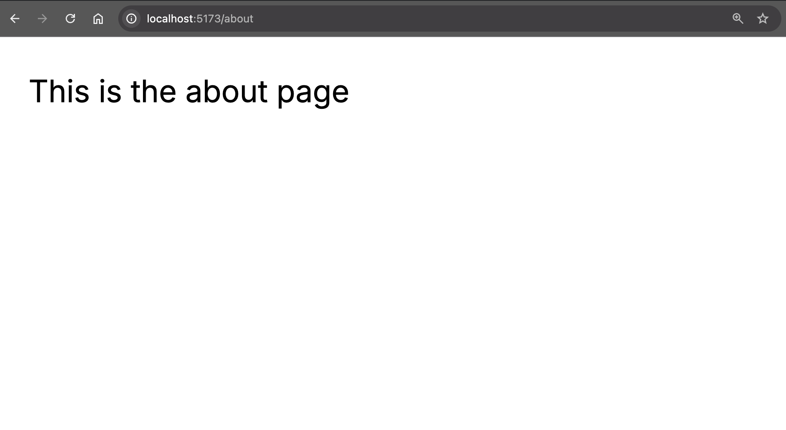

# React Router 7 and Strapi 5 Integration

## Integrate React Router 7 with Strapi

React Router is a multi-strategy router for React bridging the gap from React 18 to React 19. You can use it maximally as a React framework or minimally as a library with your own architecture.


If you're starting a new app today with React Router, you have a choice: do you want to use React Router as just a library and bring the rest of the pieces yourself? Or do you want a full framework, ala Remix? ( Now React Router 7 )


It really depends on how much of your stack you'd like to invent yourself, and how much leverage you'd like to get out of React Router.

[React Router 7 Framework](https://reactrouter.com/start/framework/installation)
[React Router 7 Library](https://reactrouter.com/start/library/installation)

## Why Use React Router 7?

React Router 7 introduces several enhancements that aim to improve developer workflow and application performance. Here's a breakdown:

For Developers:
- Simplified Installation: React Router 7 unifies core functionality into a single package, react-router, streamlining installation and management.
- Streamlined Data Handling: The removal of the json() utility function in favor of manual response object construction offers greater flexibility and transparency in data handling.
- Simplified defer Functionality: The defer function, used for delayed data loading, has been simplified, reducing boilerplate code.
- Framework Mode for Full-Stack Development: React Router 7 introduces a "framework mode" enabling full-stack React application development with features like server-side rendering (SSR), code splitting, and file-based routing, all within a familiar tool.
- Improved Nested Routing with Layout Routes: Layout routes, using the Outlet component, allow developers to define shared layouts for nested routes, reducing code duplication and promoting a clear separation of layout and content.
- Enhanced Type Safety: Improved type safety for route parameters, loader data, and actions ensures better developer experience and reduces runtime errors.

## React Router 7 and Strapi 5 Integration

## 1.1 Setup Strapi 5

We are going to start by setting up our Strapi 5 project with the following command:

You can find the full documentation for Strapi 5 [here](https://docs.strapi.io/dev-docs/intro).

``` bash
  npx create-strapi-app@latest server
```

You will be asked to choose if you would like to use Strapi Cloud we will choose to skip for now.

``` bash
 Strapi   v5.6.0 🚀 Let's create your new project

 
We can't find any auth credentials in your Strapi config.

Create a free account on Strapi Cloud and benefit from:

- ✦ Blazing-fast ✦ deployment for your projects
- ✦ Exclusive ✦ access to resources to make your project successful
- An ✦ Awesome ✦ community and full enjoyment of Strapi's ecosystem

Start your 14-day free trial now!


? Please log in or sign up. 
  Login/Sign up 
❯ Skip 
```

After you will be asked how you would like to setup your project. We will choose the following options:

``` bash
? Do you want to use the default database (sqlite) ? Yes
? Start with an example structure & data? Yes <-- make sure you say yes 
? Start with Typescript? Yes
? Install dependencies with npm? Yes
? Initialize a git repository? Yes
```

Once everything is setup and all the dependencies are installed, you can start your Strapi server with the following command:

``` bash
  cd server
  npm run develop
```

You will be greeted with the the **Admin Create Account** screen.


Go ahead and create your first Strapi user.  All of this is local so you can use whatever you want.

Once you have created your user you will be redirected to the **Strapi Dashboard** screen.


Since we created our app with the example data, you should be able to navigate to your **Article** collection and see the data that was created for us.


Now, let's make sure that all of the data is **published**.  If not, you can select all items via the checkbox and then click the **Publish** button.


Once all your articles are published, we will expose our Strapi API for the **Articles Collection** this can be done in Settings -> Users & Permissions plugin -> Roles -> Public -> Article

You should have find and findOne selected.  If not, go ahead and select them.


Now if we make a `GET` request to `http://localhost:1337/api/articles` we should see the following data for our articles.


Nice, now that we have our Strapi 5 server setup, we can start to setup our React Router 7 client.

## Getting Started with React Router 7

I will walk you through the steps to setup a new React Router 7 project. But here is the link to the [React Router 7 Docs](https://reactrouter.com/home) that I used for reference.

### React Router 7 Installation and Initial Setup

We are going to got the **React Router 7 Framework** Route.

Make sure that you are in the `root` directory of your project and run the following command to install React Router 7.

``` bash
  npx create-react-router@latest client
```

Say **Yes** to all the default options.

Once everything is installed, you can start your React Router 7 server with the following command:

``` bash
  cd client
  npm run dev
```


Nice, now that we have our React Router 7 client setup, we can start to integrate it with our Strapi 5 server.

### React Router 7 File Based Routing

We are going to opt in to use the **File Based Routing Convention** for our React Router 7 application.  

You can read more about it [here](https://reactrouter.com/how-to/file-route-conventions).

In order to do this, we must first install the following package:

``` bash
  npm i @react-router/fs-routes
```

Next, let's navigate to the `app/routes.tsx` file and update the file to the following:

``` tsx
// https://reactrouter.com/how-to/file-route-conventions

import { type RouteConfig } from "@react-router/dev/routes";
import { flatRoutes } from "@react-router/fs-routes";

export default flatRoutes() satisfies RouteConfig;
```

And finally, in the `client/app/routes` folder, rename the `home.tsx` file to `_index.tsx`.

and update the file to the following:

``` tsx
//old:
import type { Route } from "./+types/home";

// updated:
import type { Route } from "./+types/_index";

```

Now restart your React Router 7 and everything should still be working.

If you wanted to add a new route, you can do so by creating a new file in the `app/routes` folder.

Let's do a simple example.

In the `app/routes` folder, create a new file called `about.tsx`.

And update the file to the following:

``` tsx
import type { Route } from "./+types/about";

export function meta({}: Route.MetaArgs) {
  return [
    { title: "About" },
    { name: "description", content: "About Page" },
  ];
}

export default function About() {
  return <div className="container mx-auto p-4">This is the about page</div>;
}

```

Now restart your React Router 7 and you should be able to navigate to the about page at `http://localhost:5173/about`.



Nice, now that we have a basic route setup, we can start to integrate it with our Strapi 5 server.


### Fetching Data from Strapi 5 with React Router 7

We are going to opt in to use server loader to fetch data from our Strapi 5 server.

You can read more about it [here](https://reactrouter.com/start/framework/data-loading#server-data-loading).

To make this work, we need to update our `app/routes/_index.tsx` let's update the file with the following code:

``` tsx
import qs from "qs";

import type { Route } from "./+types/_index";
import { ArticleCard } from "../components/article-card";

interface Article {
  id: number;
  documentId: string;
  title: string;
  description: string;
  slug: string;
  createdAt: string;
  updatedAt: string;
  publishedAt: string;
  cover: {
    url: string;
    alternativeText: string;
  };
}

interface ArticleResponse {
  data: Article[];
}

interface LoaderData {
  articlesData: ArticleResponse;
}

// Server Side Loader
export async function loader({ params }: Route.LoaderArgs) {
  const BASE_URL = import.meta.env.VITE_STRAPI_URL || "http://localhost:1337";
  const path = "/api/articles";
  const url = new URL(path, BASE_URL);

  url.search = qs.stringify({
    populate: {
      cover: {
        fields: ["url", "alternativeText"],
      },
    },
  });

  const articlesData = await fetch(url.href);
  const data = await articlesData.json();
  return { articlesData: data as ArticleResponse };
}

export function meta(/*{}: Route.MetaArgs */) {
  return [
    { title: "Home | React Router 7" },
    { name: "description", content: "Home Page" },
  ];
}

export default function IndexRoute({ loaderData }: { loaderData: LoaderData }) {
  if (!loaderData) return <p>No data found</p>;
  return (
    <div className="container mx-auto px-4 py-8">
      <h1 className="text-3xl font-bold mb-6">
        React Router 7 and Strapi 5 Demo
      </h1>
      <div className="grid grid-cols-1 md:grid-cols-2 lg:grid-cols-3 gap-6">
        {loaderData.articlesData.data.map((article: Article) => (
          <ArticleCard
            key={article.id}
            title={article.title}
            description={article.description}
            publishedAt={article.publishedAt}
            slug={article.slug}
            cover={article.cover}
          />
        ))}
      </div>
    </div>
  );
}

```

Before this will work, we need to add two more components to our project, and install the `qs` package that will help us with the query string.

In our projects `app` folder, create a new folder called `components`. And let's add two new components to our project.

We will start with the `StrapiImage` component.

Create a new file called `strapi-image.tsx` and update the file with the following code:

``` tsx
interface StrapiImageProps {
  src: string;
  alt: string | null;
  height?: number;
  width?: number;
  className?: string;
}

const STRAPI_API_URL = process.env.STRAPI_API_URL ?? "http://localhost:1337";

export function getStrapiMedia(url: string | null) {
  if (url == null) return null;
  if (url.startsWith("data:")) return url;
  if (url.startsWith("http") || url.startsWith("//")) return url;
  return `${STRAPI_API_URL}${url}`;
}

export function StrapiImage({
  src,
  alt,
  className,
  ...rest
}: Readonly<StrapiImageProps>) {
  const imageUrl = getStrapiMedia(src);
  if (!imageUrl) return null;
  return (
    
  );
}
```
Now let's create the `ArticleCard` component.

Create a new file called `article-card.tsx` and update the file with the following code:

``` tsx 
import { StrapiImage } from "./strapi-image";

export interface ArticleCardProps {
  title: string;
  description: string;
  publishedAt: string;
  slug: string;
  cover: {
    url: string;
    alternativeText: string;
  };
}

export function ArticleCard({
  title,
  description,
  publishedAt,
  slug,
  cover,
}: Readonly<ArticleCardProps>) {
  return (
    <div className="bg-white rounded-lg shadow-md overflow-hidden hover:shadow-lg transition-shadow duration-300">
      <div className="aspect-w-16 aspect-h-9">
        <StrapiImage
          src={cover.url}
          alt={cover.alternativeText}
          className="object-cover w-full h-full"
        />
      </div>
      <div className="p-6">
        <h2 className="text-xl font-bold text-gray-800 mb-2">{title}</h2>
        <p className="text-gray-600 mb-4 line-clamp-2">{description}</p>
        <div className="flex justify-between items-center text-sm text-gray-500">
          <span>{new Date(publishedAt).toLocaleDateString()}</span>
        </div>
      </div>
    </div>
  );
}
```

And finally, let's add the `qs` package to our project.

``` bash
  npm i qs
  npm i @types/qs
```

Now restart your React Router 7 app and you Strapi 5 app and you should be able to the following screen.


Awesome, great job!

If you have any questions around Strapi 5 or just would like to stop by and say hi, you can join us at **Strapi's Discord Open Office Hours** Monday through Friday at 12:30pm - 1:30pm CST.

[Strapi Discord Open Office Hours](https://discord.com/invite/strapi)

